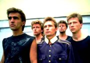

Советская и российская рок-группа, основанная в Свердловске в 1983 году Вячеславом Бутусовым и Дмитрием Умецким.

* [20 000](20%20000)
* [20000](20000)
* [9-й скотч](9-й%20скотч)
* [Абсолютное белое](Абсолютное%20белое)
* [Автор](Автор)
* [Алчи, Алчи](Алчи,%20Алчи)
* [Алчи-Алчи](Алчи-Алчи)
* [Америка](Америка)
* [Анабассис](Анабассис)
* [Апельсиновый день](Апельсиновый%20день)
* [Атлантида](Атлантида)
* [Бегущая вдаль](Бегущая%20вдаль)
* [Бедная птица](Бедная%20птица)
* [Беззаботная лень](Беззаботная%20лень)
* [Белая стена](Белая%20стена)
* [Берег](Берег)
* [Бесы](Бесы)
* [Бибигон-2](Бибигон-2)
* [Битва с магнатом](Битва%20с%20магнатом)
* [Боксер](Боксер)
* [Большое сердце](Большое%20сердце)
* [Бриллиантовые дороги](Бриллиантовые%20дороги)
* [Буги с косой](Буги%20с%20косой)
* [В итальянской опере](В%20итальянской%20опере)
* [В который раз я вижу R'N'R](В%20который%20раз%20я%20вижу%20R'N'R)
* [В.С.О.С.](В.С.О.С.)
* [Венеpа](Венеpа)
* [Венера](Венера)
* [Вертолёт](Вертолёт)
* [Взгляд с экрана (Ален Делон)](Взгляд%20с%20экрана%20(Ален%20Делон))
* [Взгляд с экрана](Взгляд%20с%20экрана)
* [Во время дождя](Во%20время%20дождя)
* [Воздух](Воздух)
* [Возьмите мое золото](Возьмите%20мое%20золото)
* [Ворота, откуда я вышел](Ворота,%20откуда%20я%20вышел)
* [Все кто нес](Все%20кто%20нес)
* [Все, кто нес](Все,%20кто%20нес)
* [Всего лишь быть](Всего%20лишь%20быть)
* [Гибралтар - Лабрадор](Гибралтар%20-%20Лабрадор)
* [Гибралтар-Лабрадор](Гибралтар-Лабрадор)
* [Город братской любви](Город%20братской%20любви)
* [Гороховые зерна](Гороховые%20зерна)
* [Гуд-бай, Америка](Гуд-бай,%20Америка)
* [Джульеттa](Джульеттa)
* [Джульетта](Джульетта)
* [Доктор Твоего Тела](Доктор%20Твоего%20Тела)
* [Дыхание](Дыхание)
* [Жажда](Жажда)
* [Железнодорожник](Железнодорожник)
* [Живая вода](Живая%20вода)
* [Заноза](Заноза)
* [Звезда поэта](Звезда%20поэта)
* [Звездочка](Звездочка)
* [Зверь](Зверь)
* [Звёздные мальчики](Звёздные%20мальчики)
* [Золотое пятно](Золотое%20пятно)
* [Иван человеков](Иван%20человеков)
* [Идиллия](Идиллия)
* [К Элоизе](К%20Элоизе)
* [Казанова](Казанова)
* [Квадратные глаза](Квадратные%20глаза)
* [Клетка](Клетка)
* [Князь тишины](Князь%20тишины)
* [Колеса любви](Колеса%20любви)
* [Конь](Конь)
* [Красные листья](Красные%20листья)
* [Крылья](Крылья)
* [Кто еще](Кто%20еще)
* [Кто ещё...](Кто%20ещё...)
* [Кто я](Кто%20я)
* [Летучая мышь](Летучая%20мышь)
* [Летучий Фрегат](Летучий%20Фрегат)
* [Люди на холме](Люди%20на%20холме)
* [Люди](Люди)
* [Маленький подвиг](Маленький%20подвиг)
* [Мальчик-зима](Мальчик-зима)
* [Матерь богов](Матерь%20богов)
* [Мифическая столовая](Мифическая%20столовая)
* [Мой брат Каин](Мой%20брат%20Каин)
* [Монгольская степь](Монгольская%20степь)
* [Морской Змей](Морской%20Змей)
* [Музыка на песке](Музыка%20на%20песке)
* [Музыка](Музыка)
* [На берегу безымянной реки](На%20берегу%20безымянной%20реки)
* [На берегу тихой реки](На%20берегу%20тихой%20реки)
* [На берегу](На%20берегу)
* [Настасья](Настасья)
* [Наша семья](Наша%20семья)
* [Небо и трава](Небо%20и%20трава)
* [Негодяй и Ангел](Негодяй%20и%20Ангел)
* [Нежный вампир](Нежный%20вампир)
* [Непорочное зачатие](Непорочное%20зачатие)
* [Никомуникабельность](Никомуникабельность)
* [Никто мне не поверит](Никто%20мне%20не%20поверит)
* [Одинокая птица](Одинокая%20птица)
* [Она ждёт любви](Она%20ждёт%20любви)
* [Отход на Север](Отход%20на%20Север)
* [Падал тёплый снег](Падал%20тёплый%20снег)
* [Падший ангел](Падший%20ангел)
* [Песня в защиту женщин](Песня%20в%20защиту%20женщин)
* [Песня в защиту мужчин](Песня%20в%20защиту%20мужчин)
* [Песня о песне](Песня%20о%20песне)
* [Пессимистия](Пессимистия)
* [Пингвинья ревность](Пингвинья%20ревность)
* [После и снова](После%20и%20снова)
* [Последнее письмо](Последнее%20письмо)
* [Последний человек на Земле](Последний%20человек%20на%20Земле)
* [Праздник общей беды](Праздник%20общей%20беды)
* [Превращение](Превращение)
* [Прогулки по воде](Прогулки%20по%20воде)
* [Прощальное письмо](Прощальное%20письмо)
* [Путь](Путь)
* [Разлука](Разлука)
* [Рвать ткань](Рвать%20ткань)
* [Родившийся в эту ночь](Родившийся%20в%20эту%20ночь)
* [Русский рок](Русский%20рок)
* [Свидание](Свидание)
* [Сестры печали](Сестры%20печали)
* [Синоптики](Синоптики)
* [Скважина](Скважина)
* [Скованные одной цепью](Скованные%20одной%20цепью)
* [Странники в ночи](Странники%20в%20ночи)
* [Стриптиз](Стриптиз)
* [Титаник](Титаник)
* [Тихие игры](Тихие%20игры)
* [Три поросера](Три%20поросера)
* [Три царя](Три%20царя)
* [Труби, Гавриил](Труби,%20Гавриил)
* [Тутанхамон](Тутанхамон)
* [Умершие во сне](Умершие%20во%20сне)
* [Утро Полины](Утро%20Полины)
* [Фанта-джюс](Фанта-джюс)
* [Хлоп Хлоп](Хлоп%20Хлоп)
* [Хлоп-Хлоп](Хлоп-Хлоп)
* [Христос (Мне снилось что...)](Христос%20(Мне%20снилось%20что...))
* [Человек На Луне](Человек%20На%20Луне)
* [Человек без имени](Человек%20без%20имени)
* [Черные птицы](Черные%20птицы)
* [Чистый бес](Чистый%20бес)
* [Чугада](Чугада)
* [Чужая земля](Чужая%20земля)
* [Чужой](Чужой)
* [Шар цвета хаки](Шар%20цвета%20хаки)
* [Шар цвета хакки](Шар%20цвета%20хакки)
* [Эпиграф](Эпиграф)
* [Эта Музыка Будет вечной](Эта%20Музыка%20Будет%20вечной)
* [Эти реки](Эти%20реки)
* [Я не вернусь](Я%20не%20вернусь)
* [Я хочу быть с тобой](Я%20хочу%20быть%20с%20тобой)
* [Ястребиная свадьба](Ястребиная%20свадьба)