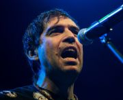

Российская рок-группа из Москвы, популярная с начала 1990-х годов. Лидером и автором практически всех текстов и музыки является основатель группы Максим Покровский.

* [280 дней](280%20дней)
* [Remember harry man bo-ro](Remember%20harry%20man%20bo-ro)
* [Белые каллы](Белые%20каллы)
* [Бензин](Бензин)
* [Больные роботы](Больные%20роботы)
* [В темноте](В%20темноте)
* [Волки](Волки)
* [Голый клоун](Голый%20клоун)
* [День рождения](День%20рождения)
* [Из Алма-Аты](Из%20Алма-Аты)
* [Измажемся](Измажемся)
* [Клязьма](Клязьма)
* [Колыбельная](Колыбельная)
* [Кровавые мальчики](Кровавые%20мальчики)
* [Кукла](Кукла)
* [Лариса](Лариса)
* [Лилипутская любовь-1](Лилипутская%20любовь-1)
* [Лилипутская любовь-2](Лилипутская%20любовь-2)
* [Лилипутская любовь](Лилипутская%20любовь)
* [Московский Романс](Московский%20Романс)
* [Муж на работе](Муж%20на%20работе)
* [На Тихорецкую](На%20Тихорецкую)
* [Наши Юные Смешные Голоса](Наши%20Юные%20Смешные%20Голоса)
* [Печальная Лариса](Печальная%20Лариса)
* [Поликлиника](Поликлиника)
* [Последнее танго](Последнее%20танго)
* [Реки](Реки)
* [Семь планет](Семь%20планет)
* [Счастлива, потому что беременна-4](Счастлива,%20потому%20что%20беременна-4)
* [Хара мамбуру](Хара%20мамбуру)
* [Хару Мамбуру](Хару%20Мамбуру)
* [Хуй](Хуй)
* [Часики](Часики)
* [Черви](Черви)
* [Четыре друга](Четыре%20друга)