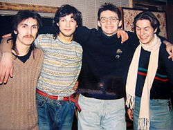

Советская и российская рок-группа, была основана певцом-баянистом Фёдором «Дядя Фёдор» Чистяковым вместе с барабанщиком Алексеем «Николс» Николаевым и Анатолием Платоновым в Ленинграде осенью 1985 года.

* [90 градусов ниже нуля](90%20градусов%20ниже%20нуля)
* [Аборт](Аборт)
* [Барыня](Барыня)
* [Безобразия](Безобразия)
* [Блуждающий биоробот №2](Блуждающий%20биоробот%20№2)
* [Блуждающий биоробот](Блуждающий%20биоробот)
* [Буги-вуги каждый день](Буги-вуги%20каждый%20день)
* [Будет всё хорошо](Будет%20всё%20хорошо)
* [В саду у дяди Миши](В%20саду%20у%20дяди%20Миши)
* [Верещагин](Верещагин)
* [Вперёд, болты](Вперёд,%20болты)
* [Все будет хорошо](Все%20будет%20хорошо)
* [Вставай](Вставай)
* [Гадюка](Гадюка)
* [Говнорок](Говнорок)
* [Год Козла](Год%20Козла)
* [Гони тараканов (2 вариант)](Гони%20тараканов%20(2%20вариант))
* [Гони тараканов](Гони%20тараканов)
* [Граница, стоять](Граница,%20стоять)
* [День большой осы](День%20большой%20осы)
* [Деньги](Деньги)
* [Доктор Хайдер](Доктор%20Хайдер)
* [Ехали по улицам трамваи...](Ехали%20по%20улицам%20трамваи...)
* [Ехали по улицам трамваи](Ехали%20по%20улицам%20трамваи)
* [Жизнь](Жизнь)
* [Журавель](Журавель)
* [Завтра будет тот же день](Завтра%20будет%20тот%20же%20день)
* [Игра в любовь](Игра%20в%20любовь)
* [Иду курю](Иду%20курю)
* [Иду, курю](Иду,%20курю)
* [Имя моё](Имя%20моё)
* [Имя](Имя)
* [Инвалид нулевой группы](Инвалид%20нулевой%20группы)
* [Как оно есть](Как%20оно%20есть)
* [Кислотный дождь](Кислотный%20дождь)
* [Когда проснется Бах](Когда%20проснется%20Бах)
* [Когда проснётся Бах](Когда%20проснётся%20Бах)
* [Кожаный соловей](Кожаный%20соловей)
* [Коммунальные квартиры](Коммунальные%20квартиры)
* [Лица](Лица)
* [Любовь ушла](Любовь%20ушла)
* [Любовь](Любовь)
* [Лёгкая эротика](Лёгкая%20эротика)
* [Мажорище](Мажорище)
* [Марш энтузиастов II](Марш%20энтузиастов%20II)
* [Мнe нe мecтo в этoм миpe](Мнe%20нe%20мecтo%20в%20этoм%20миpe)
* [Мне не место в этом мире](Мне%20не%20место%20в%20этом%20мире)
* [Море](Море)
* [Московский вокзал](Московский%20вокзал)
* [Музыка драчёвых напильников](Музыка%20драчёвых%20напильников)
* [Мухи](Мухи)
* [Мы будем тут](Мы%20будем%20тут)
* [Мы идём пить квас](Мы%20идём%20пить%20квас)
* [На 90 градусов ниже нуля](На%2090%20градусов%20ниже%20нуля)
* [Нам дан старт](Нам%20дан%20старт)
* [Наш день](Наш%20день)
* [Наши лица](Наши%20лица)
* [Осень](Осень)
* [Песня о настоящем индейце](Песня%20о%20настоящем%20индейце)
* [Песня про НАСТОЯЩЕГО индейца (2 вариант)](Песня%20про%20НАСТОЯЩЕГО%20индейца%20(2%20вариант))
* [Песня про НАСТОЯЩЕГО индейца](Песня%20про%20НАСТОЯЩЕГО%20индейца)
* [Прости, что не верил](Прости,%20что%20не%20верил)
* [Просто я живу на улице Ленина...](Просто%20я%20живу%20на%20улице%20Ленина...)
* [Пушки - в зад](Пушки%20-%20в%20зад)
* [Радио Любитель](Радио%20Любитель)
* [Русская экологическая (2 вариант)](Русская%20экологическая%20(2%20вариант))
* [Русская экологическая](Русская%20экологическая)
* [СПИД](СПИД)
* [Самолет](Самолет)
* [Самцы и самки](Самцы%20и%20самки)
* [Северное буги](Северное%20буги)
* [Сказка о колбасе](Сказка%20о%20колбасе)
* [Сказка про колбаску](Сказка%20про%20колбаску)
* [Танго (быль)](Танго%20(быль))
* [Трамваи](Трамваи)
* [Ты - тормоз](Ты%20-%20тормоз)
* [Тёмная ночь](Тёмная%20ночь)
* [Улица Ленина](Улица%20Ленина)
* [Цикорий](Цикорий)
* [Человек и Кошка (2 вариант)](Человек%20и%20Кошка%20(2%20вариант))
* [Человек и Кошка](Человек%20и%20Кошка)
* [Что так сердце растревожено](Что%20так%20сердце%20растревожено)
* [Школа жизни (2 вариант)](Школа%20жизни%20(2%20вариант))
* [Школа жизни](Школа%20жизни)
* [Э.Т.О.Я.Л.Ю.Б.Л.Ю.Т.Е.Б.Я.](Э.Т.О.Я.Л.Ю.Б.Л.Ю.Т.Е.Б.Я.)
* [Этот русский Rock-n-roll](Этот%20русский%20Rock-n-roll)
* [Я - самолет](Я%20-%20самолет)
* [Я - самолёт](Я%20-%20самолёт)
* [Я проиграл](Я%20проиграл)
* [Я уже человек](Я%20уже%20человек)
* [Я.Л.Ю.Б.Л.Ю.Т.Е.Б.Я.](Я.Л.Ю.Б.Л.Ю.Т.Е.Б.Я.)