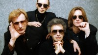

Советская и российская ленинградская рок-группа с Эдмундом Шклярским во главе.

* [Aianostre](Aianostre)
* [А может быть и не было меня](А%20может%20быть%20и%20не%20было%20меня)
* [А учили меня летать](А%20учили%20меня%20летать)
* [Адреналиновые песни](Адреналиновые%20песни)
* [Афродита из пены и щелочи](Афродита%20из%20пены%20и%20щелочи)
* [Бал](Бал)
* [Бедный Робинзон Крузо](Бедный%20Робинзон%20Крузо)
* [Будильник](Будильник)
* [Будь навсегда](Будь%20навсегда)
* [В развороченном раю](В%20развороченном%20раю)
* [Вдалеке от городов](Вдалеке%20от%20городов)
* [Великан](Великан)
* [Великий бог - рубль](Великий%20бог%20-%20рубль)
* [Вертолет (часть 1 и 2)](Вертолет%20(часть%201%20и%202))
* [Вертолёт (2 вариант)](Вертолёт%20(2%20вариант))
* [Вертолёт](Вертолёт)
* [Весна](Весна)
* [Ветер лилипутов](Ветер%20лилипутов)
* [Вечер](Вечер)
* [Взгляд туманный пьет нирвану](Взгляд%20туманный%20пьет%20нирвану)
* [Взгляд туманный пьёт нирвану](Взгляд%20туманный%20пьёт%20нирвану)
* [Вот и тень моя...](Вот%20и%20тень%20моя...)
* [Все вокруг боятся радости паяца](Все%20вокруг%20боятся%20радости%20паяца)
* [Все остальное - дым](Все%20остальное%20-%20дым)
* [Всё остальное - дым](Всё%20остальное%20-%20дым)
* [Герой](Герой)
* [Герр Захер Мозох](Герр%20Захер%20Мозох)
* [Глаза очерчены углем](Глаза%20очерчены%20углем)
* [Глаза очерчены углём](Глаза%20очерчены%20углём)
* [Говорит и показывает (2 вариант)](Говорит%20и%20показывает%20(2%20вариант))
* [Говорит и показывает](Говорит%20и%20показывает)
* [Граф Д](Граф%20Д)
* [Дай себя сорвать](Дай%20себя%20сорвать)
* [Два великана](Два%20великана)
* [Две судьбы](Две%20судьбы)
* [Деньги](Деньги)
* [Дикие игры](Дикие%20игры)
* [Диск-жокей](Диск-жокей)
* [До Содома далеко](До%20Содома%20далеко)
* [Египтянин](Египтянин)
* [Еще один дождь](Еще%20один%20дождь)
* [Ещё один дождь](Ещё%20один%20дождь)
* [Железный орех](Железный%20орех)
* [За невинно убиенных](За%20невинно%20убиенных)
* [Заратустра](Заратустра)
* [Здесь под желтым солнцем ламп](Здесь%20под%20желтым%20солнцем%20ламп)
* [Здесь под жёлтым солнцем ламп](Здесь%20под%20жёлтым%20солнцем%20ламп)
* [Знаки в окне](Знаки%20в%20окне)
* [Золушка](Золушка)
* [И всё](И%20всё)
* [И летает голова то вверх, то вниз](И%20летает%20голова%20то%20вверх,%20то%20вниз)
* [И светлый ангел над ним](И%20светлый%20ангел%20над%20ним)
* [Иероглиф](Иероглиф)
* [Иероним](Иероним)
* [Из коры себе подругу выстругал](Из%20коры%20себе%20подругу%20выстругал)
* [Из мышеловки](Из%20мышеловки)
* [Инквизитор](Инквизитор)
* [Интересно](Интересно)
* [Искры около рта](Искры%20около%20рта)
* [Искушение](Искушение)
* [Истерика](Истерика)
* [Ихтиандр](Ихтиандр)
* [Караван](Караван)
* [Клянись же, ешь землю (2 вариант)](Клянись%20же,%20ешь%20землю%20(2%20вариант))
* [Клянись же, ешь землю](Клянись%20же,%20ешь%20землю)
* [Когда призрачный свет](Когда%20призрачный%20свет)
* [Королевство кривых](Королевство%20кривых)
* [Кот](Кот)
* [Кровь, остынь (Фараон)](Кровь,%20остынь%20(Фараон))
* [Купорос-Е](Купорос-Е)
* [Лакомо и ломко](Лакомо%20и%20ломко)
* [Лихорадка](Лихорадка)
* [Лицо](Лицо)
* [Лишь влюбленному вампиру](Лишь%20влюбленному%20вампиру)
* [Лишь влюблённому вампиру (2 вариант)](Лишь%20влюблённому%20вампиру%20(2%20вариант))
* [Миллион в мешке](Миллион%20в%20мешке)
* [Много дивного на свете (2 вариант)](Много%20дивного%20на%20свете%20(2%20вариант))
* [Много дивного на свете](Много%20дивного%20на%20свете)
* [Мракобесие и джаз](Мракобесие%20и%20джаз)
* [Мы - как трепетные птицы...](Мы%20-%20как%20трепетные%20птицы...)
* [Мы как трепетные птицы](Мы%20как%20трепетные%20птицы)
* [На луче...](На%20луче...)
* [Навуходоносор](Навуходоносор)
* [Навуходосор](Навуходосор)
* [Настоящие дни](Настоящие%20дни)
* [Настрадался Нострадамус от людей](Настрадался%20Нострадамус%20от%20людей)
* [Не говори мне ''Нет''](Не%20говори%20мне%20''Нет'')
* [Не кончается пытка](Не%20кончается%20пытка)
* [Немного огня](Немного%20огня)
* [Немое кино](Немое%20кино)
* [Нет берегов](Нет%20берегов)
* [Ни твое ни мое](Ни%20твое%20ни%20мое)
* [Ни твоё, ни моё](Ни%20твоё,%20ни%20моё)
* [Нигредо](Нигредо)
* [Новозеландская песня](Новозеландская%20песня)
* [Ночь](Ночь)
* [Оборотень](Оборотень)
* [Опиумный дым](Опиумный%20дым)
* [Осень](Осень)
* [Остров (2 вариант)](Остров%20(2%20вариант))
* [Остров](Остров)
* [От Кореи до Карелии](От%20Кореи%20до%20Карелии)
* [Отучи же меня говорить](Отучи%20же%20меня%20говорить)
* [Очень интересно](Очень%20интересно)
* [Падший ангел - сын греха](Падший%20ангел%20-%20сын%20греха)
* [Пентакль](Пентакль)
* [Перламутр и пырей](Перламутр%20и%20пырей)
* [Пикник (2 вариант)](Пикник%20(2%20вариант))
* [Пикник](Пикник)
* [Пить электричество](Пить%20электричество)
* [Побежать бы за леса-горы](Побежать%20бы%20за%20леса-горы)
* [Под желтым солнцем ламп](Под%20желтым%20солнцем%20ламп)
* [Под звездою под одной](Под%20звездою%20под%20одной)
* [Пол и потолок](Пол%20и%20потолок)
* [Праздник](Праздник)
* [Раз, два...](Раз,%20два...)
* [Разбойники](Разбойники)
* [Романс](Романс)
* [С высоты некуда упасть](С%20высоты%20некуда%20упасть)
* [С тех пор, как сгорели дома](С%20тех%20пор,%20как%20сгорели%20дома)
* [Самый звонкий крик - тишина](Самый%20звонкий%20крик%20-%20тишина)
* [Себе не найдя двойников](Себе%20не%20найдя%20двойников)
* [Сердце бьётся на три четверти](Сердце%20бьётся%20на%20три%20четверти)
* [Серебра (2 вариант)](Серебра%20(2%20вариант))
* [Серебра](Серебра)
* [Скользить по земле](Скользить%20по%20земле)
* [Смутные дни](Смутные%20дни)
* [Стоя на этой лестнице (Вспоминая Led Zeppelin)](Стоя%20на%20этой%20лестнице%20(Вспоминая%20Led%20Zeppelin))
* [Стоя на этой лестнице](Стоя%20на%20этой%20лестнице)
* [Там, на самом краю Земли (2 вариант)](Там,%20на%20самом%20краю%20Земли%20(2%20вариант))
* [Там, на самом краю земли](Там,%20на%20самом%20краю%20земли)
* [Твое сердце должно быть моим](Твое%20сердце%20должно%20быть%20моим)
* [Твоё сердце должно быть моим](Твоё%20сердце%20должно%20быть%20моим)
* [Телефон](Телефон)
* [Теперь ты](Теперь%20ты)
* [Течет большая река](Течет%20большая%20река)
* [Ты вся из огня](Ты%20вся%20из%20огня)
* [У шамана три руки](У%20шамана%20три%20руки)
* [Упругие их имена](Упругие%20их%20имена)
* [Упыри и вурдалаки сотоварищи его](Упыри%20и%20вурдалаки%20сотоварищи%20его)
* [Фиолетово-Черный](Фиолетово-Черный)
* [Фиолетово-чёрный](Фиолетово-чёрный)
* [Хоровод (2 вариант)](Хоровод%20(2%20вариант))
* [Хоровод](Хоровод)
* [Через 10000 лет](Через%2010000%20лет)
* [Шарманка](Шарманка)
* [Это он](Это%20он)
* [Это река Ганг (2 вариант)](Это%20река%20Ганг%20(2%20вариант))
* [Это река Ганг](Это%20река%20Ганг)
* [Этот мир не ждёт гостей](Этот%20мир%20не%20ждёт%20гостей)
* [Я - пущенная стрела (2 вариант)](Я%20-%20пущенная%20стрела%20(2%20вариант))
* [Я - пущенная стрела](Я%20-%20пущенная%20стрела)
* [Я иду по дну](Я%20иду%20по%20дну)
* [Я невидим](Я%20невидим)
* [Я почти итальянец](Я%20почти%20итальянец)