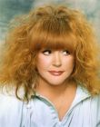

Советская и российская певица эстрады.

* [Айсберг](Айсберг)
* [Без меня](Без%20меня)
* [До свиданья, лето](До%20свиданья,%20лето)
* [Звездное лето](Звездное%20лето)
* [Куда уходит детство](Куда%20уходит%20детство)
* [Маэстро](Маэстро)
* [На Бис](На%20Бис)
* [Не отрекаются любя](Не%20отрекаются%20любя)
* [Осенний поцелуй](Осенний%20поцелуй)
* [Песенка про меня](Песенка%20про%20меня)
* [Примадонна](Примадонна)
* [Прости, поверь](Прости,%20поверь)
* [Старинные часы](Старинные%20часы)
* [Только не назад](Только%20не%20назад)
* [Это любовь](Это%20любовь)