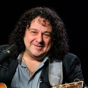

* [Funny Love](Funny%20Love)
* [Miami Beach](Miami%20Beach)
* [Алина](Алина)
* [Ах, зачем](Ах,%20зачем)
* [Белая ночь](Белая%20ночь)
* [Будь со мной](Будь%20со%20мной)
* [Бухта радости](Бухта%20радости)
* [Визави](Визави)
* [Возвращайся](Возвращайся)
* [Всё было](Всё%20было)
* [Вчерашний день](Вчерашний%20день)
* [Горькая обида](Горькая%20обида)
* [Две сестры](Две%20сестры)
* [День без тебя](День%20без%20тебя)
* [Дорогие мои старики](Дорогие%20мои%20старики)
* [Если нам по пути](Если%20нам%20по%20пути)
* [Если ты уходишь](Если%20ты%20уходишь)
* [Желаю тебе](Желаю%20тебе)
* [Жили-были](Жили-были)
* [Журавли](Журавли)
* [За рекою, за рекой](За%20рекою,%20за%20рекой)
* [Зажигаю тебя](Зажигаю%20тебя)
* [Закрылась дверь](Закрылась%20дверь)
* [Зачем вернулась ты](Зачем%20вернулась%20ты)
* [Зелёные глаза](Зелёные%20глаза)
* [Знаю, будет больно](Знаю,%20будет%20больно)
* [Золотые горы](Золотые%20горы)
* [И горит свеча](И%20горит%20свеча)
* [Иду встречать рассвет](Иду%20встречать%20рассвет)
* [Как же ты могла](Как%20же%20ты%20могла)
* [Какая ты красивая](Какая%20ты%20красивая)
* [Караванщик Али](Караванщик%20Али)
* [Карнавал](Карнавал)
* [Километры](Километры)
* [Красавица](Красавица)
* [Крутой поворот](Крутой%20поворот)
* [ЛА-МА-ЛА](ЛА-МА-ЛА)
* [Лала Лило](Лала%20Лило)
* [Листопад](Листопад)
* [Лодочка](Лодочка)
* [Любовь не любит слов](Любовь%20не%20любит%20слов)
* [Любовь](Любовь)
* [Маленькая девочка](Маленькая%20девочка)
* [Мама](Мама)
* [Мария](Мария)
* [Маскарад](Маскарад)
* [Мотылёк](Мотылёк)
* [Моя любовь](Моя%20любовь)
* [Музыка](Музыка)
* [На Киевском вокзале](На%20Киевском%20вокзале)
* [На Чёрном море](На%20Чёрном%20море)
* [На английском](На%20английском)
* [На кошачьих лапках тишина](На%20кошачьих%20лапках%20тишина)
* [Не рассказывай](Не%20рассказывай)
* [Не твоя, не моя](Не%20твоя,%20не%20моя)
* [Они любили друг друга](Они%20любили%20друг%20друга)
* [Ослепительная блондинка](Ослепительная%20блондинка)
* [Останься](Останься)
* [Падал снег](Падал%20снег)
* [Пальмы](Пальмы)
* [Парень с гитарой](Парень%20с%20гитарой)
* [Парижское такси](Парижское%20такси)
* [Поминальная](Поминальная)
* [Поплакала и хватит](Поплакала%20и%20хватит)
* [Придуманная любовь](Придуманная%20любовь)
* [Проводы](Проводы)
* [Пьеро](Пьеро)
* [Разве может быть](Разве%20может%20быть)
* [Рождественская ночь](Рождественская%20ночь)
* [Рыжая звезда](Рыжая%20звезда)
* [Сандра](Сандра)
* [Серенада](Серенада)
* [Сима](Сима)
* [Скрипка-лиса](Скрипка-лиса)
* [Слово в слово](Слово%20в%20слово)
* [Старики](Старики)
* [Стылая осень](Стылая%20осень)
* [Сухуми](Сухуми)
* [Тик-так](Тик-так)
* [Только с тобой](Только%20с%20тобой)
* [Тонкая струна](Тонкая%20струна)
* [Ты ли это](Ты%20ли%20это)
* [Ты одна](Ты%20одна)
* [Флейта в саду](Флейта%20в%20саду)
* [Холодно](Холодно)
* [Холодный свет](Холодный%20свет)
* [Цыган](Цыган)
* [Это не любовь](Это%20не%20любовь)
* [Я один](Я%20один)
* [Я хочу побыть один](Я%20хочу%20побыть%20один)
* [Я хочу смотреть](Я%20хочу%20смотреть)
* [Я хочу сойти с ума](Я%20хочу%20сойти%20с%20ума)
* [Ящики почтовые](Ящики%20почтовые)