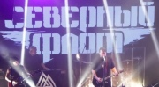

Российская рок-группа, образованная из музыкантов группы "Король и Шут" после гибели Михаила Горшенёва.  
Лидер группы Александр Леонтьев.

* [Ветер ходит налегке](Ветер%20ходит%20налегке)
* [Вперёд и вверх](Вперёд%20и%20вверх)
* [Каждую ночь](Каждую%20ночь)
* [Поднимая знамя](Поднимая%20знамя)
* [Рождённый убивать](Рождённый%20убивать)
* [Стрелы](Стрелы)
* [Харон](Харон)