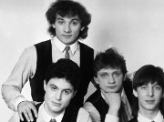

Советская и российская рок-группа, основанная Николаем Фоменко, Максимом Леонидовым и Дмитрием Рубином в Ленинграде в 1983 году.

* [10 лет](10%20лет)
* [1000 пластинок](1000%20пластинок)
* [17 лет](17%20лет)
* [2000 год](2000%20год)
* [Blues De Moscou](Blues%20De%20Moscou)
* [Roadrunner](Roadrunner)
* [Rock'n'roll medley](Rock'n'roll%20medley)
* [Алиса (2 вариант)](Алиса%20(2%20вариант))
* [Алиса](Алиса)
* [Ангел дороги](Ангел%20дороги)
* [Арина-балерина](Арина-балерина)
* [Беда - не беда](Беда%20-%20не%20беда)
* [Белая птица](Белая%20птица)
* [Береги свой хой](Береги%20свой%20хой)
* [Беспечный ездок](Беспечный%20ездок)
* [Билет](Билет)
* [Блюз бродячих собак](Блюз%20бродячих%20собак)
* [Буги-вуги](Буги-вуги)
* [Букетик незабудок](Букетик%20незабудок)
* [В дальних странах](В%20дальних%20странах)
* [В жарких странах (Капитаны)](В%20жарких%20странах%20(Капитаны))
* [Весна](Весна)
* [Ветер новых дней](Ветер%20новых%20дней)
* [Вниз по течению](Вниз%20по%20течению)
* [Возьми меня](Возьми%20меня)
* [Вспомни годы](Вспомни%20годы)
* [Всё ОК](Всё%20ОК)
* [Где найти слова](Где%20найти%20слова)
* [Давай, заводи](Давай,%20заводи)
* [Дай мне шанс](Дай%20мне%20шанс)
* [Дай мне](Дай%20мне)
* [Дарю, дарю](Дарю,%20дарю)
* [Дарю-дарю](Дарю-дарю)
* [Две гантели и один утюг](Две%20гантели%20и%20один%20утюг)
* [Доктор Оттепель](Доктор%20Оттепель)
* [Домой](Домой)
* [Если ты уйдешь](Если%20ты%20уйдешь)
* [Еще не поздно](Еще%20не%20поздно)
* [Зенит - чемпион](Зенит%20-%20чемпион)
* [Иди домой](Иди%20домой)
* [Именины у Кристины](Именины%20у%20Кристины)
* [Как дела, старина](Как%20дела,%20старина)
* [Кеды](Кеды)
* [Кончайте, папа](Кончайте,%20папа)
* [Конь](Конь)
* [Коррида](Коррида)
* [Ленинградское время](Ленинградское%20время)
* [Лиза](Лиза)
* [Любовь Петровна](Любовь%20Петровна)
* [Мажорный рок-н-ролл](Мажорный%20рок-н-ролл)
* [Мама](Мама)
* [Между небом и землёй](Между%20небом%20и%20землёй)
* [Морские волки](Морские%20волки)
* [Москва-река](Москва-река)
* [Моя любовь на пятом этаже (2 вариант)](Моя%20любовь%20на%20пятом%20этаже%20(2%20вариант))
* [Моя любовь на пятом этаже](Моя%20любовь%20на%20пятом%20этаже)
* [Музыка нон-стоп](Музыка%20нон-стоп)
* [Не Грусти](Не%20Грусти)
* [Не говори мне прощай](Не%20говори%20мне%20прощай)
* [Не забудь](Не%20забудь)
* [Не переживай](Не%20переживай)
* [Не плачь, гитара](Не%20плачь,%20гитара)
* [Не трогай только гитару](Не%20трогай%20только%20гитару)
* [Ничего не бойся](Ничего%20не%20бойся)
* [Ничего не исчезает](Ничего%20не%20исчезает)
* [Ночь](Ночь)
* [Ну что мне делать](Ну%20что%20мне%20делать)
* [Обиды не тая](Обиды%20не%20тая)
* [Одна в трехкомнатной квартире](Одна%20в%20трехкомнатной%20квартире)
* [Одна в трёхкомнатной квартире](Одна%20в%20трёхкомнатной%20квартире)
* [Она не понимает](Она%20не%20понимает)
* [Она считает меня дураком](Она%20считает%20меня%20дураком)
* [Она так любит](Она%20так%20любит)
* [Оркестр в пути](Оркестр%20в%20пути)
* [Отказали тормоза](Отказали%20тормоза)
* [Отправляйся за ней](Отправляйся%20за%20ней)
* [Патрульный Петров](Патрульный%20Петров)
* [Перелетная птица](Перелетная%20птица)
* [Песенка про ведьму](Песенка%20про%20ведьму)
* [Песня гномов](Песня%20гномов)
* [По дороге домой](По%20дороге%20домой)
* [Пойди туда](Пойди%20туда)
* [Попутная](Попутная)
* [Пора бежать](Пора%20бежать)
* [Посвящение Битлз](Посвящение%20Битлз)
* [Последний трамвай](Последний%20трамвай)
* [Последний час декабря](Последний%20час%20декабря)
* [Почему](Почему)
* [Привет](Привет)
* [Прощай, ночь, прости](Прощай,%20ночь,%20прости)
* [Прощай](Прощай)
* [Пусть будет так всегда](Пусть%20будет%20так%20всегда)
* [Путь в сторону солнца](Путь%20в%20сторону%20солнца)
* [Рая и Ада](Рая%20и%20Ада)
* [Рита](Рита)
* [Розы и сталь](Розы%20и%20сталь)
* [С нами Бог](С%20нами%20Бог)
* [Сара Бара-Бу](Сара%20Бара-Бу)
* [Сара Барабу](Сара%20Барабу)
* [Секретомания](Секретомания)
* [Сердце на твоем берегу](Сердце%20на%20твоем%20берегу)
* [Сердце на твоём берегу](Сердце%20на%20твоём%20берегу)
* [Сидя на крыше](Сидя%20на%20крыше)
* [Скоро навсегда](Скоро%20навсегда)
* [Снова рядом](Снова%20рядом)
* [Сон в руку](Сон%20в%20руку)
* [Сорок секунд](Сорок%20секунд)
* [Старый джаз](Старый%20джаз)
* [Старый ковбой](Старый%20ковбой)
* [Странные дни](Странные%20дни)
* [Студент](Студент)
* [Твист](Твист)
* [Твои шаги](Твои%20шаги)
* [Твой папа был прав](Твой%20папа%20был%20прав)
* [То, что называется Любовь](То,%20что%20называется%20Любовь)
* [Ты вернёшься ко мне](Ты%20вернёшься%20ко%20мне)
* [Ты и я](Ты%20и%20я)
* [Ты умеешь летать](Ты%20умеешь%20летать)
* [Убегай, крошка](Убегай,%20крошка)
* [Уист Уи](Уист%20Уи)
* [Четыре](Четыре)
* [Шаг за шагом](Шаг%20за%20шагом)
* [Эй, парень](Эй,%20парень)
* [Это не любовь](Это%20не%20любовь)
* [Я вас созвал](Я%20вас%20созвал)
* [Я встречу тебя](Я%20встречу%20тебя)
* [Я снова бегу](Я%20снова%20бегу)