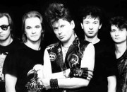

Советская и российская рок-группа из Воронежа. Основатель и автор текстов Юрий Клинских (Хой).

* [30 лет](30%20лет)
* [Life](Life)
* [Аборт или роды](Аборт%20или%20роды)
* [Аванс](Аванс)
* [Автомат](Автомат)
* [Ангел секса](Ангел%20секса)
* [Ария Кащея](Ария%20Кащея)
* [Ария графа Дракулы](Ария%20графа%20Дракулы)
* [БОМЖ](БОМЖ)
* [Банка](Банка)
* [Без вина](Без%20вина)
* [Белая горячка](Белая%20горячка)
* [Богатые тоже плачут](Богатые%20тоже%20плачут)
* [Вальпуpгиева ночь](Вальпуpгиева%20ночь)
* [Вампиры](Вампиры)
* [Вдова](Вдова)
* [Вечером на лавочке](Вечером%20на%20лавочке)
* [Взял вину на себя](Взял%20вину%20на%20себя)
* [Возле дома твоего](Возле%20дома%20твоего)
* [Война](Война)
* [Восставший из Ада](Восставший%20из%20Ада)
* [Вурдалак](Вурдалак)
* [Вылазка](Вылазка)
* [ГАИ (водительская-подхалимская)](ГАИ%20(водительская-подхалимская))
* [Голубой](Голубой)
* [Грязная кровь](Грязная%20кровь)
* [Гуляй, мужик](Гуляй,%20мужик)
* [Девушка](Девушка)
* [Демобилизация](Демобилизация)
* [Домой](Домой)
* [Дурак](Дурак)
* [Дураки](Дураки)
* [Еду бабу выручать...](Еду%20бабу%20выручать...)
* [Если бы](Если%20бы)
* [Звездная болезнь](Звездная%20болезнь)
* [Звонок](Звонок)
* [Злая ночь](Злая%20ночь)
* [Из чего же](Из%20чего%20же)
* [Илья Муромец](Илья%20Муромец)
* [Кабак](Кабак)
* [Казачья](Казачья)
* [Караван](Караван)
* [Карданный вал - ваучер](Карданный%20вал%20-%20ваучер)
* [Когда помрешь](Когда%20помрешь)
* [Колхозная](Колхозная)
* [Колхозный Панк](Колхозный%20Панк)
* [Колыбельная](Колыбельная)
* [Комары](Комары)
* [Ку-ку](Ку-ку)
* [Кусок](Кусок)
* [ЛТП](ЛТП)
* [Лирика](Лирика)
* [Любовь загробная](Любовь%20загробная)
* [Любовь раскумаренная](Любовь%20раскумаренная)
* [Мажор](Мажор)
* [Мак](Мак)
* [Марш наркоманов](Марш%20наркоманов)
* [Мастурбация](Мастурбация)
* [Мент](Мент)
* [Местные](Местные)
* [Метаморфоза](Метаморфоза)
* [Миньет](Миньет)
* [Моя бабка](Моя%20бабка)
* [Моя смерть](Моя%20смерть)
* [Мумия](Мумия)
* [Мы - совковские ребята](Мы%20-%20совковские%20ребята)
* [Нажми на газ](Нажми%20на%20газ)
* [Наркоман](Наркоман)
* [Нас ждут из темноты](Нас%20ждут%20из%20темноты)
* [Не дает](Не%20дает)
* [Новогодняя песня](Новогодняя%20песня)
* [Носки](Носки)
* [Ночь Перед Рождеством](Ночь%20Перед%20Рождеством)
* [Ночь страха](Ночь%20страха)
* [Оборотень](Оборотень)
* [Ой ты, травушка зеленая](Ой%20ты,%20травушка%20зеленая)
* [Опарыш](Опарыш)
* [Опять сегодня](Опять%20сегодня)
* [Пасха](Пасха)
* [Патриот](Патриот)
* [Пердун](Пердун)
* [Песенка](Песенка)
* [План](План)
* [Плуги-Вуги](Плуги-Вуги)
* [Подвал](Подвал)
* [Подкуп](Подкуп)
* [Попэц](Попэц)
* [Пора домой](Пора%20домой)
* [Похмел](Похмел)
* [Презерватив - 2](Презерватив%20-%202)
* [Проститутка](Проститутка)
* [Рога](Рога)
* [Русский мат](Русский%20мат)
* [Самогонщики](Самогонщики)
* [Свадьба](Свадьба)
* [Свидание](Свидание)
* [Свин](Свин)
* [Святая война](Святая%20война)
* [Сектор Газа](Сектор%20Газа)
* [Сельский кайф](Сельский%20кайф)
* [Сифон](Сифон)
* [Скотник](Скотник)
* [Снегурочка](Снегурочка)
* [Сожженная ведьма](Сожженная%20ведьма)
* [Солнышко](Солнышко)
* [Спокойной ночи, малыши](Спокойной%20ночи,%20малыши)
* [Спор](Спор)
* [Страх](Страх)
* [Суд](Суд)
* [Сумасшедший труп](Сумасшедший%20труп)
* [Танцы после порева](Танцы%20после%20порева)
* [Твой звонок](Твой%20звонок)
* [Теща](Теща)
* [Трепак](Трепак)
* [Туман](Туман)
* [Укус вампира](Укус%20вампира)
* [Утопленник](Утопленник)
* [Хата](Хата)
* [Хорошо в деревне летом](Хорошо%20в%20деревне%20летом)
* [Частушки](Частушки)
* [Черная магия](Черная%20магия)
* [Чунга - Чанга](Чунга%20-%20Чанга)
* [Эстрадная песня](Эстрадная%20песня)
* [Я мочился в ночь](Я%20мочился%20в%20ночь)
* [Я мразь](Я%20мразь)
* [Я устал](Я%20устал)
* [Ява](Ява)
* [Ядрёна вошь](Ядрёна%20вошь)
* [Як на хуторе](Як%20на%20хуторе)