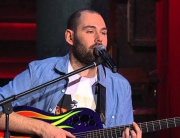

Российский продюсер, комедийный актер, автор-исполнитель песен. Бывший капитан команды КВН "**Сборная Пятигорска**".

* [Бабушка трансформер](Бабушка%20трансформер)
* [Встала баба на весы](Встала%20баба%20на%20весы)
* [Где бы взять мне бабу](Где%20бы%20взять%20мне%20бабу)
* [Гимн офисного работника](Гимн%20офисного%20работника)
* [До свадьбы нельзя](До%20свадьбы%20нельзя)
* [Жопа растёт](Жопа%20растёт)
* [Залепи своё дуло](Залепи%20своё%20дуло)
* [Квартира в Москве](Квартира%20в%20Москве)
* [Круглосуточно красивая женщина](Круглосуточно%20красивая%20женщина)
* [Люба   звезда Ютьюба](Люба%20%20%20звезда%20Ютьюба)
* [Отец Онуфрий](Отец%20Онуфрий)
* [Очень красивая](Очень%20красивая)
* [Песня абсолютно счастливого человека](Песня%20абсолютно%20счастливого%20человека)
* [Песня про трусы](Песня%20про%20трусы)
* [Песня российского чиновника](Песня%20российского%20чиновника)
* [Разговор мужа с женой](Разговор%20мужа%20с%20женой)
* [Сука сосед](Сука%20сосед)
* [Твою мать](Твою%20мать)
* [Хочу хача](Хочу%20хача)
* [Экстрасенс](Экстрасенс)
* [Я затрахался трахаться](Я%20затрахался%20трахаться)