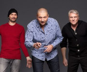

Советская и российская рок-группа, основанная в 1987 году Александром Минаевым и Павлом Молчановым. Группа позиционирует себя как ансамбль мотологической музыки.

* [Look](Look)
* [Rock-Women](Rock-Women)
* [Taxi](Taxi)
* [Автономное питание](Автономное%20питание)
* [Альпинист-водолаз](Альпинист-водолаз)
* [Башня](Башня)
* [Блинчики со сметаной](Блинчики%20со%20сметаной)
* [Брелок](Брелок)
* [Будет еще круче](Будет%20еще%20круче)
* [Буратино](Буратино)
* [Весна](Весна)
* [Ветер дальних стран](Ветер%20дальних%20стран)
* [Возьми мое сердце](Возьми%20мое%20сердце)
* [Вот моё весло](Вот%20моё%20весло)
* [Время полночных снов](Время%20полночных%20снов)
* [Где мои винтики](Где%20мои%20винтики)
* [Голос](Голос)
* [Дай мне уйти](Дай%20мне%20уйти)
* [Два года (Памяти П.Ж.)](Два%20года%20(Памяти%20П.Ж.))
* [Дуся](Дуся)
* [Дым](Дым)
* [Ехан Палыч](Ехан%20Палыч)
* [Желтые качели](Желтые%20качели)
* [Желтые рыббы](Желтые%20рыббы)
* [Жертвы научной фантастики](Жертвы%20научной%20фантастики)
* [Иду по краю](Иду%20по%20краю)
* [Как прожить без зла](Как%20прожить%20без%20зла)
* [Кантри](Кантри)
* [Клоуны](Клоуны)
* [Коммерческий вальс](Коммерческий%20вальс)
* [Коровье вымя](Коровье%20вымя)
* [Люди как люди](Люди%20как%20люди)
* [Лётчик](Лётчик)
* [Маразматические догоныыы](Маразматические%20догоныыы)
* [Милая ночь](Милая%20ночь)
* [Мир афиш, витрин](Мир%20афиш,%20витрин)
* [Монгольское море](Монгольское%20море)
* [Мрачная песня](Мрачная%20песня)
* [Начало](Начало)
* [Не зови](Не%20зови)
* [Не тормози](Не%20тормози)
* [Ненавижу](Ненавижу)
* [Никто меня не любит](Никто%20меня%20не%20любит)
* [Новогодняя](Новогодняя)
* [Ода мне](Ода%20мне)
* [Океан](Океан)
* [Осень](Осень)
* [Осколки зла](Осколки%20зла)
* [Пpo Нaвoз](Пpo%20Нaвoз)
* [Песня Сухэ-Батора](Песня%20Сухэ-Батора)
* [Песня карточного короля](Песня%20карточного%20короля)
* [Песня про ежа](Песня%20про%20ежа)
* [Песня про навоз](Песня%20про%20навоз)
* [Песня про яму](Песня%20про%20яму)
* [Плюц про цацета](Плюц%20про%20цацета)
* [По барабану](По%20барабану)
* [Предательская песня](Предательская%20песня)
* [Про лысых](Про%20лысых)
* [Про навоз](Про%20навоз)
* [Про пиво](Про%20пиво)
* [Пружина дней](Пружина%20дней)
* [Пьяная песня](Пьяная%20песня)
* [Романс](Романс)
* [Рыббацко-охотничья](Рыббацко-охотничья)
* [Самолёт](Самолёт)
* [Самый лучший день](Самый%20лучший%20день)
* [Саша, я хочу стать космонавтом](Саша,%20я%20хочу%20стать%20космонавтом)
* [Сосулька](Сосулька)
* [Страданья](Страданья)
* [Судьба](Судьба)
* [Сумочка-нора](Сумочка-нора)
* [Только вдвоём](Только%20вдвоём)
* [Флаг кораблю](Флаг%20кораблю)
* [Человек-амфибия](Человек-амфибия)
* [Шигидарупупай](Шигидарупупай)
* [Шире шаг](Шире%20шаг)
* [Школьница](Школьница)
* [Я люблю кататься](Я%20люблю%20кататься)
* [Я с тобой](Я%20с%20тобой)
* [Яблочко](Яблочко)