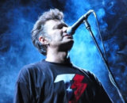

Советская и российская рок-группа из Ленинграда, сочетающая тяжелую электронную музыку с мрачными текстами.

* [Dooma](Dooma)
* [Ада нет](Ада%20нет)
* [Акварель](Акварель)
* [Алла Борисна](Алла%20Борисна)
* [Аллилуйя](Аллилуйя)
* [Бабуины](Бабуины)
* [Беги-беги](Беги-беги)
* [Без сахара](Без%20сахара)
* [Белый лебедь](Белый%20лебедь)
* [Быть бы](Быть%20бы)
* [Вера](Вера)
* [Внутри](Внутри)
* [Всё в порядке](Всё%20в%20порядке)
* [Вчера](Вчера)
* [Выйти из-под контроля](Выйти%20из-под%20контроля)
* [Город](Город)
* [Гости](Гости)
* [Дальний Восток](Дальний%20Восток)
* [День Михаила](День%20Михаила)
* [Дети уходят](Дети%20уходят)
* [До-Мажор](До-Мажор)
* [Душа](Душа)
* [Дым-туман](Дым-туман)
* [Дым](Дым)
* [Если телефон молчит](Если%20телефон%20молчит)
* [Завтра](Завтра)
* [Звёздная](Звёздная)
* [Когда ты умрёшь](Когда%20ты%20умрёшь)
* [Кожа апельсинья](Кожа%20апельсинья)
* [Конца света не будет](Конца%20света%20не%20будет)
* [Костыли](Костыли)
* [Кто ты](Кто%20ты)
* [Лают](Лают)
* [Листик](Листик)
* [Люди в ожидании](Люди%20в%20ожидании)
* [Люли-люли](Люли-люли)
* [Мандариновый снег](Мандариновый%20снег)
* [Мания величия](Мания%20величия)
* [Мегамизантроп](Мегамизантроп)
* [Мечта самоубийцы](Мечта%20самоубийцы)
* [Молча](Молча)
* [Музыка для мёртвых](Музыка%20для%20мёртвых)
* [Муха на стекле](Муха%20на%20стекле)
* [Муха-блюз](Муха-блюз)
* [Мы идём](Мы%20идём)
* [Мы не хотим быть мишенями](Мы%20не%20хотим%20быть%20мишенями)
* [На Желябова, 13](На%20Желябова,%2013)
* [Не в себе](Не%20в%20себе)
* [Не плачь](Не%20плачь)
* [Негодяй](Негодяй)
* [Нет денег](Нет%20денег)
* [Никому не нужен](Никому%20не%20нужен)
* [Обо мне](Обо%20мне)
* [Обходи](Обходи)
* [Огнетушитель](Огнетушитель)
* [Отечество иллюзий](Отечество%20иллюзий)
* [Отчуждение](Отчуждение)
* [Палец](Палец)
* [Пластмасса](Пластмасса)
* [Политпесня](Политпесня)
* [Полночный человек](Полночный%20человек)
* [Полуфабрикаты](Полуфабрикаты)
* [Послушай, я вчера](Послушай,%20я%20вчера)
* [Потребитель](Потребитель)
* [Пронесло](Пронесло)
* [Пустой](Пустой)
* [Путь к успеху](Путь%20к%20успеху)
* [Рыба гниёт с головы](Рыба%20гниёт%20с%20головы)
* [С вами говорит телевизор](С%20вами%20говорит%20телевизор)
* [Случайно](Случайно)
* [Сыт по горло](Сыт%20по%20горло)
* [Танго](Танго)
* [Тараканы](Тараканы)
* [Твой папа - фашист](Твой%20папа%20-%20фашист)
* [Тепло](Тепло)
* [Товарищ Сухов](Товарищ%20Сухов)
* [Три-четыре гада](Три-четыре%20гада)
* [Ты на пути в Чикаго](Ты%20на%20пути%20в%20Чикаго)
* [Укатала](Укатала)
* [Унижение](Унижение)
* [Уходи один](Уходи%20один)
* [Ушла из дома](Ушла%20из%20дома)
* [Холод](Холод)
* [Цветные сны](Цветные%20сны)
* [Человек из ваты](Человек%20из%20ваты)
* [Шанс](Шанс)
* [Шествие рыб](Шествие%20рыб)
* [Я не виноват](Я%20не%20виноват)
* [Я у вольных, у небес...](Я%20у%20вольных,%20у%20небес...)