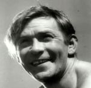

Советский эстрадный артист, певец, исполнитель романсов и джазовых композиций.

* [В землянке](В%20землянке)
* [Как много девушек хороших](Как%20много%20девушек%20хороших)
* [Песня Извозчика](Песня%20Извозчика)
* [Песня старого извозчика](Песня%20старого%20извозчика)
* [Тайна](Тайна)
* [Шаланды полные кефали](Шаланды%20полные%20кефали)