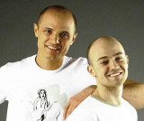

Российская поп-группа Ильи Подстрелова и Игоря Панченко.

* [200 Грамм](200%20Грамм)
* [Heiss, baby](Heiss,%20baby)
* [А мне так пох...](А%20мне%20так%20пох...)
* [А я не сплю](А%20я%20не%20сплю)
* [Барон](Барон)
* [Боль навсегда](Боль%20навсегда)
* [Братан](Братан)
* [Бродяга](Бродяга)
* [В нашем стиле](В%20нашем%20стиле)
* [Весна](Весна)
* [Война](Война)
* [Воспоминания](Воспоминания)
* [Встреча](Встреча)
* [Где беламора достать](Где%20беламора%20достать)
* [Девочка Люся](Девочка%20Люся)
* [Девочка-Мальвина](Девочка-Мальвина)
* [Для тебя](Для%20тебя)
* [Друган](Друган)
* [Измена](Измена)
* [К малолетке](К%20малолетке)
* [Казанова](Казанова)
* [Как мне жаль](Как%20мне%20жаль)
* [Класс, Детка, Класс](Класс,%20Детка,%20Класс)
* [Королева снежная](Королева%20снежная)
* [Красавица](Красавица)
* [Мальвина](Мальвина)
* [Марихуана 3000](Марихуана%203000)
* [Меньше пить](Меньше%20пить)
* [Мой альбом](Мой%20альбом)
* [Мы Фальшивые МС](Мы%20Фальшивые%20МС)
* [Не надо](Не%20надо)
* [Некому мне](Некому%20мне)
* [Ну, так иди же сюда](Ну,%20так%20иди%20же%20сюда)
* [Одинокая звезда](Одинокая%20звезда)
* [Отчим](Отчим)
* [Первый раз](Первый%20раз)
* [Пиво](Пиво)
* [Письма](Письма)
* [Посмотри мне в глаза](Посмотри%20мне%20в%20глаза)
* [Преступление](Преступление)
* [Привидение](Привидение)
* [Рейс 666](Рейс%20666)
* [Родина](Родина)
* [Руссаки (Пиво выпью я)](Руссаки%20(Пиво%20выпью%20я))
* [Свадьба](Свадьба)
* [Сон](Сон)
* [Ссора](Ссора)
* [Стой, девченка, стой](Стой,%20девченка,%20стой)
* [Твой](Твой)
* [Тихо-тихо](Тихо-тихо)
* [Ты прости меня](Ты%20прости%20меня)
* [Ты у меня одна](Ты%20у%20меня%20одна)
* [Улетали журавли](Улетали%20журавли)
* [Что у тебя в душе](Что%20у%20тебя%20в%20душе)
* [Шалава](Шалава)
* [Штаны](Штаны)
* [Эй девчонки](Эй%20девчонки)
* [Я узнал](Я%20узнал)